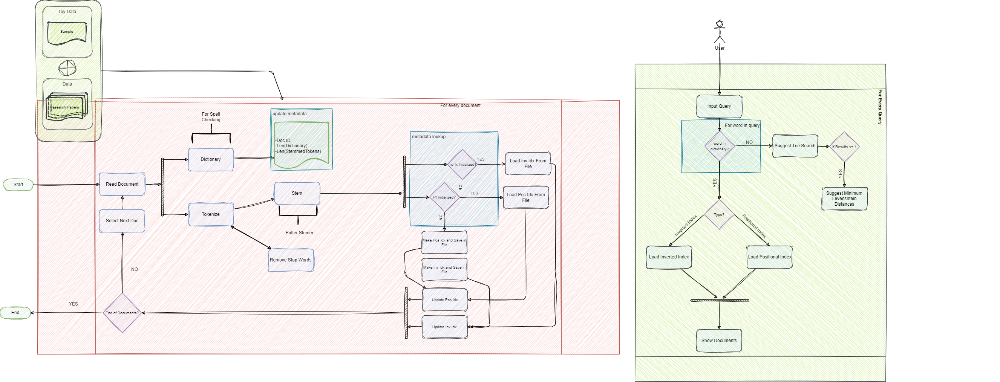
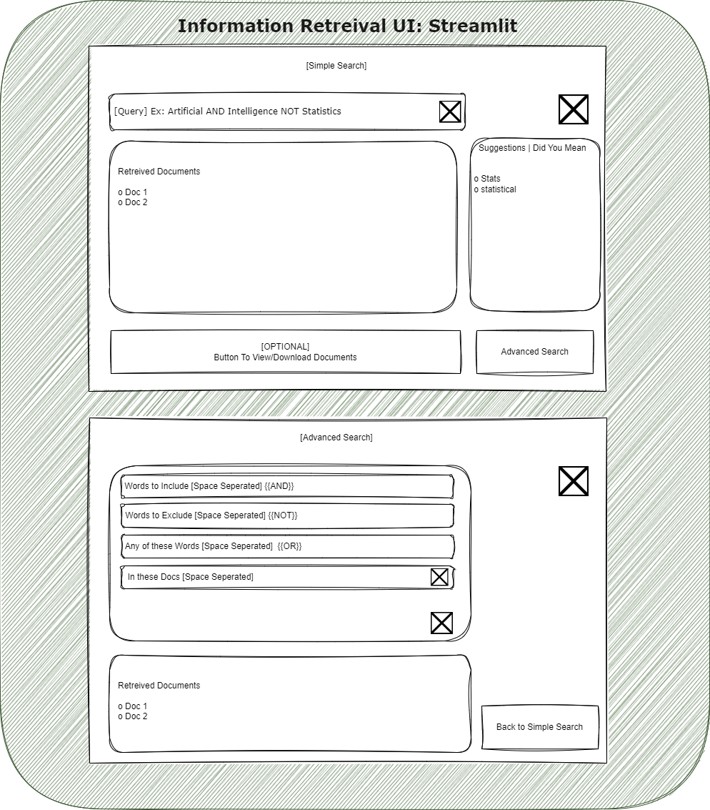

# Information Retrieval Indexing Project

This project aims to demonstrate the creation of Inverted Index and Positional Index for a collection of research papers, facilitating the Boolean Model of Information Retrieval. Additionally, it includes a simple Boolean Model implementation and tools for text preprocessing.

## Project Structure

```plaintext
/IR_Indexing_Project
  ├── data/
  │   ├── ResearchPapers/
  │   │   ├── 1.txt
  │   │   ├── 2.txt
  │   │   └── ... (and so on)
  │   └── stop_words.txt
  ├── src/
  │   ├── indexes/
  │   │   ├── inverted_index.json
  │   │   ├── positional_index.json
  │   │   └── {all defined indexes for docs}.json
  │   ├── logs/
  │   │   └── metadata.log (for retrieving pre-defined indexes)
  │   ├── inverted_index.py
  │   ├── positional_index.py
  │   ├── boolean_model.py
  │   ├── porter_stemmer.py
  │   ├── tokenizer.py
  │   └── main.py
  ├── tests/
  │   ├── test_inverted_index.py
  │   ├── test_positional_index.py
  │   ├── test_boolean_model.py
  │   └── test_data/
  │       └── test_collection.txt
  │── app/ Streamlit App
  ├── README.md
  └── requirements.txt
```

## Project Components

- **`data/`:** Contains the collection of research papers in the `ResearchPapers/` directory and a file `stop_words.txt` listing common stop words.

- **`src/`:** Contains the source code for indexing, querying, and text processing.
  - **`indexes/`:** Directory to store the generated index files in JSON format.
  - **`logs/`:** Directory for logging, including `metadata.log` for retrieving pre-defined indexes.
  - **`inverted_index.py`:** Module for creating and querying the inverted index.
  - **`positional_index.py`:** Module for creating and querying the positional index.
  - **`boolean_model.py`:** Module for implementing the Boolean Model of Information Retrieval.
  - **`porter_stemmer.py`:** Module for implementing the Porter stemming algorithm.
  - **`tokenizer.py`:** Module for tokenizing text.

- **`tests/`:** Contains unit tests to ensure the correctness of the implemented functionalities.
  - **`test_inverted_index.py`:** Unit tests for the inverted index.
  - **`test_positional_index.py`:** Unit tests for the positional index.
  - **`test_boolean_model.py`:** Unit tests for the Boolean Model implementation.

- **`app/`:** Directory for a Streamlit App if applicable.

- **`README.md`:** Project documentation providing an overview, instructions, and usage examples.

- **`requirements.txt`:** File listing all Python dependencies required to run the project.

## Flows
#### Data Flow Diagram



#### UI Desing




## Usage

Follow the instructions in the README to run the project, execute tests, and understand the results. Customize the project according to your specific needs and extend functionalities as necessary.