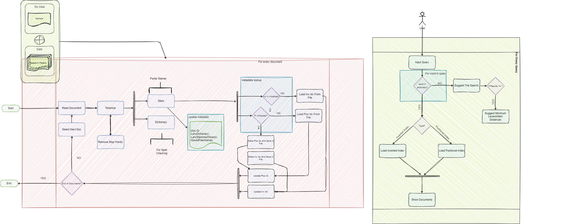
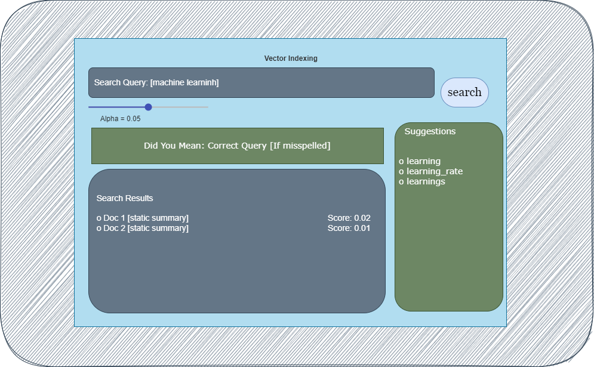

# IR-Indexing

Welcome to the IR-Indexing project! This Flask app facilitates Information Retrieval using various indexing techniques. The project structure is outlined below, providing an overview of the organization and key components.

## Project Structure

```plaintext
IR-Indexing
├── data/
│   ├── ResearchPapers/
│   │   ├── 1.txt
│   │   ├── 2.txt
│   │   ├── 3.txt
│   │   ├── ... (and so on)
│   └── Stopword-List.txt
├── logs/ (local)
├── flows/
│   ├── data-flow.png
|   ├── ui.png
├── src/
│   ├── indexes/ (local)
│   ├── vocab/ (local)
│   ├── boolean_model.py
│   ├── extended_boolean.py
│   ├── inverted_index.py
│   ├── porter_stemmer.py
│   ├── positional_index.py
│   ├── processor.py
│   ├── retreival.py
│   ├── tokenizer.py
│   ├── trie_search.py
│   ├── utils.py
│   ├── word_corrector.py
│   └── word_suggestor.py
├── static/
│   ├── script.js
│   └── styles.css
├── templates/
│   └── index.html
├── tests/
│   ├── test_sets/
│   │   ├── golden_boolean_queries.txt
│   │   └── golden_proximity_queries.txt
│   ├── test_boolean_retrieval.py
│   ├── test_ext_boolean_retrieval.py
│   ├── test_inverted_index.py
│   ├── test_porter_stem.py
│   └── test_positional_retireval.py
├── .gitignore
├── app.py
├── README.md
└── requirements.txt
```

## Project Components

- **`data/`:** Contains research papers in the `ResearchPapers/` directory and a file `Stopword-List.txt` with common stop words.
  - Simply place new files in this folder, and the app will automatically index them.
  - Don't Remove `Stopword-List.txt` as it is used for stop word removal, though you can update the .txt file manually.

- **`flows/`:** Contains diagrams and drawings illustrating data flows and UI design.

- **`src/`:** Contains the source code for the app and various modules for indexing and retrieval.

- **`static/`:** Includes JavaScript (`script.js`) and CSS (`styles.css`) files for static content.

- **`templates/`:** Contains HTML template for rendering pages.
  
- **`tests/`:** Contains unit tests with corresponding test sets for various functionalities.
  
  - **`tests/test_sets:`** Add your test sets in the files
    - `golden_boolean_queries.txt`
    - `golden_proximity_queries.txt`
    - Enter Queries of the form:
      - Example Query: TOUR_QUERY 
      - Result-Set: EXPECTED_RESULTS

- **`app.py`:** The main Flask application file.

## Flow & Design
### Data Flow 


### UI design



## Functionality

The app offers efficient retrieval capabilities, emphasizing performance and user experience.

### Index Generation and Metadata Logging

- Index generation occurs at the beginning and is only performed once, saving indexes to files.
- Metadata, including information about file structure and indexes, is logged for future reference.
- If indexes are requested again, the app checks  for changes in data and regenerates only the necessary indexes.

### Performance Logging

- Essential performance metrics are logged, providing insights into processing times for index formation, search operations, and more.
- This information helps in monitoring and optimizing the efficiency of the retrieval system.

### Query Processing

- The app prompts users to enter queries, whether boolean or proximity-based.
- The algorithm determines the query type and performs the search accordingly.
- Suggestions for words are provided to users, enhancing the query input experience.
- Trie-based searching is employed for efficient and fast word suggestions.

### Search Results Presentation

- If documents match the user's query, the app presents the corresponding document IDs.
- In the absence of matching documents, the app attempts to correct the query using Levenshtein distance on a word-by-word basis.
- The corrected query is presented to the user, and if the original and corrected queries are identical, the user is informed that no documents match the query.

### Logging User Interaction

- The app logs important information about user queries, errors, and search results.
- This logging allows for a comprehensive review of user interactions, aiding in system analysis and improvement.

The combined features ensure a seamless and efficient experience for users interacting with the IR-Indexing app, promoting effective information retrieval and user-friendly query processing.


## Usage

1. Set up a Python environment and install dependencies:

    ```bash
    pip install -r requirements.txt
    ```

2. Run the Flask app:

    ```bash
    python app.py
    ```

3. Open a web browser and navigate to `http://127.0.0.1:5000/` to interact with the app.

## Tests
Run the tests to ensure the correctness of the implemented functionalities:

```bash
python -m unittest discover tests
```

## Acknowledgements 
- The Porter Stemmer implementation is based on the original algorithm by Martin Porter.
  -  Source: [https://vijinimallawaarachchi.com/2017/05/09/porter-stemming-algorithm/](https://vijinimallawaarachchi.com/2017/05/09/porter-stemming-algorithm/)
  -   GitHub Repository: [https://github.com/jedijulia/porter-stemmer/blob/master/stemmer.py](https://github.com/jedijulia/porter-stemmer/)

- The Levenshtein distance algorithm is based on the original algorithm by Vladimir Levenshtein.
  - Source: [https://en.wikipedia.org/wiki/Levenshtein_distance](https://en.wikipedia.org/wiki/Levenshtein_distance)


<details>
  <summary>Code Stats</summary>


Total : 25 files,  2018 codes, 41 comments, 399 blanks, all 2458 lines

## Languages
| language | files | code | comment | blank | total |
| :--- | ---: | ---: | ---: | ---: | ---: |
| Python | 20 | 1,636 | 35 | 330 | 2,001 |
| CSS | 1 | 128 | 2 | 27 | 157 |
| JavaScript | 1 | 106 | 4 | 17 | 127 |
| Markdown | 1 | 58 | 0 | 17 | 75 |
| pip requirements | 1 | 50 | 0 | 1 | 51 |
| HTML | 1 | 40 | 0 | 7 | 47 |

## Directories
| path | files | code | comment | blank | total |
| :--- | ---: | ---: | ---: | ---: | ---: |
| . | 25 | 2,018 | 41 | 399 | 2,458 |
| . (Files) | 4 | 155 | 0 | 28 | 183 |
| src | 13 | 1,444 | 28 | 286 | 1,758 |
| static | 2 | 234 | 6 | 44 | 284 |
| templates | 1 | 40 | 0 | 7 | 47 |
| tests | 5 | 145 | 7 | 34 | 186 |

</details>

Feel free to customize the project according to your specific needs and extend functionalities as necessary.